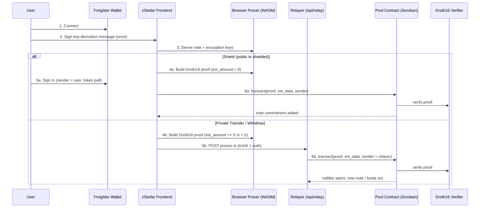
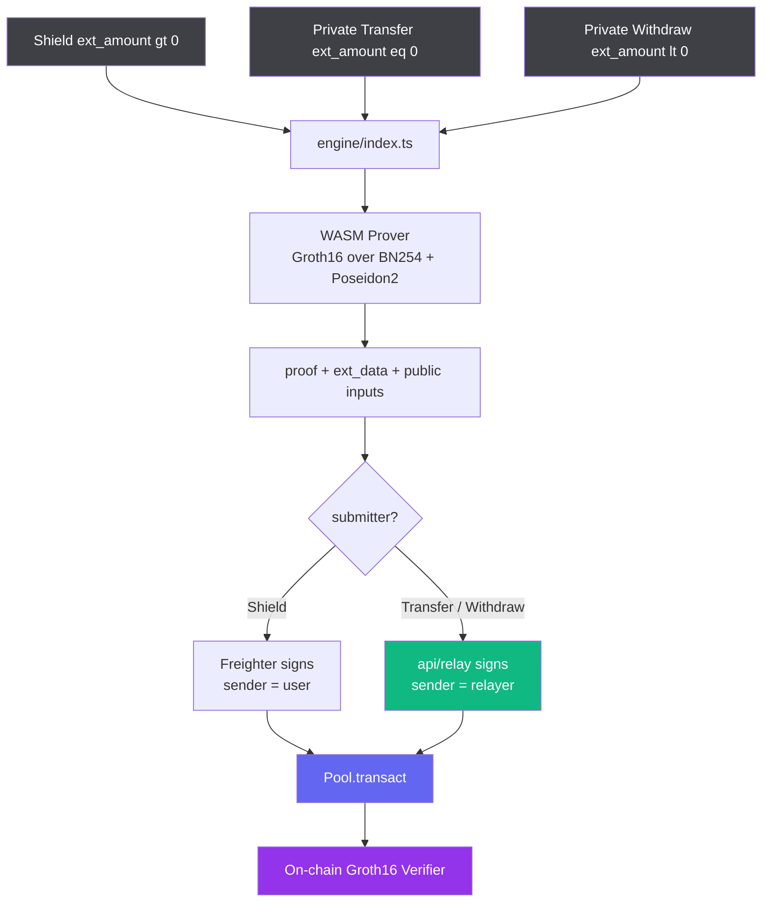

<p align="center">
  
</p>

<h1 align="center">zStellar</h1>

<p align="center">
  The privacy layer for payments on Stellar — deposit, pay, and cash out without revealing amounts or the sender&nbsp;→&nbsp;receiver link.
</p>

<p align="center">
  
  
  
  
  
</p>

<p align="center">
  <a href="#quick-start">Quick Start</a> ·
  <a href="#how-it-works">How It Works</a> ·
  <a href="#architecture">Architecture</a> ·
  <a href="#smart-contracts">Contracts</a> ·
  <a href="#deployment">Deployment</a>
</p>

> ⚠️ **Testnet only · unaudited · never use with real funds.** zStellar builds on
> [Nethermind's Stellar Private Payments PoC](https://github.com/NethermindEth/stellar-private-payments)
> — research/educational software that inherits its testnet-only constraint.

---

## Overview

zStellar is a shielded payments dApp built on **Soroban** and an **on-chain Groth16 verifier on Stellar**. A user deposits a public Stellar asset into a shielded pool, transfers value privately to other users inside the pool, and withdraws back to a public address — all without revealing transfer amounts or the sender → receiver link on-chain.

Every zero-knowledge proof is generated **client-side in WebAssembly** (Groth16 over BN254 with a Poseidon2 hash), and private transfers and withdrawals are pushed through a **server-side relayer** so the note owner's address never appears on-chain.

> **One pool. Three flows. One rule: your balance and your counterparties stay private.**
>
> - **Shield** moves a public asset into the pool. Your in-pool balance hides behind note commitments.
> - **Private Transfer** pays another user inside the pool. The amount and the sender → receiver link stay hidden.
> - **Private Withdraw** cashes out to any public Stellar address. The relayer submits, so your address never appears.

---

## Table of Contents

- [Quick Start](#quick-start)
- [Why zStellar](#why-zstellar)
- [The Three Flows](#the-three-flows)
- [How It Works](#how-it-works)
- [Architecture](#architecture)
- [Tech Stack](#tech-stack)
- [Key Files](#key-files)
- [Smart Contracts](#smart-contracts)
- [Deployment](#deployment)
- [Hackathon](#hackathon)
- [License](#license)

---

## Quick Start

> All commands run from `frontend/`. This project uses **pnpm** (not npm) and **Biome** (not ESLint/Prettier).

### Prerequisites

- Node.js 20+ and pnpm
- A [Freighter](https://www.freighter.app/) wallet on Stellar Testnet
- A Chromium-based browser — `SharedArrayBuffer` and OPFS are required by the WASM prover

### Install & run

```bash
git clone https://github.com/ln-tc999/zstellar-main.git
cd zstellar-main/frontend

pnpm install
pnpm dev          # http://localhost:3000
```

Routes: the landing page is at `/`, and the app is at `/app`.

### Relayer (required for Private Transfer / Withdraw)

```bash
node scripts/setup-relayer.mjs
```

Generates and Friendbot-funds the relayer, then writes `RELAYER_SECRET` (server-only) and `NEXT_PUBLIC_RELAYER_ADDRESS` to `.env.local`. The secret has no `NEXT_PUBLIC_` prefix, so it never ships to the browser — only `/api/relay` reads it. **Never commit `.env.local`** (it is gitignored).

Optional environment overrides (default to Stellar testnet):

```bash
NEXT_PUBLIC_STELLAR_RPC_URL=https://soroban-testnet.stellar.org
NEXT_PUBLIC_STELLAR_HORIZON_URL=https://horizon-testnet.stellar.org
```

> For production deployment (relayer env vars, keeping the account funded, COOP/COEP, hosting), see **[docs/DEPLOYMENT.md](docs/DEPLOYMENT.md)**.

---

## Why zStellar

Stellar is fully transparent by design. Every payment, amount, and account balance is public and permanently indexed. For real-world payments — payroll, donations, vendor settlements — that transparency is a liability, not a feature.

The existing options fall short:

- **Fresh wallets per payment** — tedious, and the funding hop still links the new wallet back to the source on the public graph.
- **Centralized mixers or custodians** — the user surrenders custody, trusts an operator, and re-introduces a single point of failure and seizure.
- **Generic privacy chains** — leaving Stellar means leaving its assets, liquidity, and tooling behind.
- **Naive "hide the amount" tricks** — without a real ZK circuit and an on-chain verifier, nothing actually proves the transfer is valid while the value stays hidden.

None of them offer a compliance-friendly anonymity set, where deposits can be gated by an approval list without de-anonymizing honest users.

**How might we let a user pay on Stellar with the amount and counterparty hidden, the validity proven on-chain, and custody never surrendered?**

zStellar answers this with six core primitives on the Soroban stack:

1. **Client-side Groth16 proving (WASM)** — proofs are built in the browser by a Rust→WASM prover (arkworks `ark-groth16` / `ark-circom`) compiled from Circom circuits. Secret inputs (note keys, amounts, blindings) never leave the device; the hash is Poseidon2 over BN254, and proving runs off-thread in a Web Worker with OPFS-backed SQLite.
2. **Shielded note pool** — deposits create note commitments in an on-chain Merkle tree. Spending a note reveals only a nullifier (no double-spend) and a new output commitment — never the amount or the owner.
3. **Three flows, one entrypoint** — Shield (`ext_amount > 0`), Private Transfer (`== 0`), and Private Withdraw (`< 0`) all route through one `transact` call.
4. **On-chain verification** — the pool is gated by a Groth16 verifier contract over BN254. The proof binds `ext_data`, so amounts and recipients can't be tampered with after proving.
5. **ASP membership** — an Association Set Provider keeps a Merkle tree of approved deposits (`insert_leaf`). Honest users prove membership without revealing which leaf is theirs.
6. **Relayer-submitted privacy** — a server-side relayer keypair (`/api/relay`) becomes the tx source and the `sender` of `transact`, pays the fee, and signs on-chain. The note owner never appears on the ledger.

<details>
<summary><b>Meet Sarah</b> — the person this is for</summary>

<br>

Sarah runs a small remote studio and pays five contractors in stablecoins on Stellar. Stellar is fast and cheap, which she loves. The problem: every payment is public. Anyone with her address can see exactly who she pays, how much, and how often, plus her entire running balance. A competitor scraped her payment history once and used it to poach a contractor by name.

Sarah does not want a private chain. She wants to keep using Stellar — its liquidity and its assets — but she wants the *amounts* and the *links* between her and her payees to be invisible. Fresh wallets per payment are a manual mess and the graph still connects on the funding hop. An off-chain ledger means trusting a custodian with her money.

Her problem is not a missing chain. It is that there is no way to send a Stellar payment where the amount and the counterparty stay private, the proof is verified on-chain, and nobody ever holds her funds.

</details>

---

## The Three Flows

zStellar runs three flows through one pool and one `transact` entrypoint. The only thing that changes is the signed `ext_amount` and who submits.

|  | **Shield** | **Private Transfer** | **Private Withdraw** |
|---|---|---|---|
| **Direction** | public → shielded | shielded → shielded | shielded → public |
| **`ext_amount`** | `> 0` | `== 0` | `< 0` |
| **Recipient field** | none (your own notes) | recipient's shielded address (note key + encryption key) | public Stellar address (`G...`) |
| **Submitter** | your wallet (token pull needs your auth) | relayer | relayer |
| **On-chain effect** | tokens pulled in, note commitment added | nullifier spent, new note for recipient | nullifier spent, tokens leave the pool |
| **Result** | balance now shielded | recipient's balance stays shielded | funds public again in the target wallet |
| **What stays hidden** | your in-pool balance | amount and the sender → receiver link | amount and your submitter address |

**Why all three matter:** Shield is the on-ramp into privacy, Transfer is the everyday case (pay someone, stay private), and Withdraw is the off-ramp back to public XLM — together covering the full payment lifecycle without ever forcing the user off Stellar.

```
if action == "shield":
    ext_amount > 0  -> wallet submits (token pull needs user auth)
if action == "transfer":
    ext_amount == 0 -> relayer submits (recipient = shielded address)
if action == "withdraw":
    ext_amount < 0  -> relayer submits (recipient = public G-address)
```

---

## How It Works

**User flow** — `Connect → Shield → Receive / Pay privately → Withdraw to public`

1. **Connect** Freighter on Testnet and fund with the in-app faucet if needed.
2. **Shield** a public asset into the pool (you sign; tokens are pulled in and a note commitment is created).
3. **Receive** a shielded address from your Receive modal, or **Pay** a contact's shielded address with a Private Transfer.
4. **Withdraw** any time to a public `G...` address; the relayer submits, so your address never appears.
5. **Track** every action through the proof stepper and the View-transaction explorer link.

**Proof flow (browser)** — `Derive keys → Build circuit inputs → Prove (Groth16) → Prepare Soroban tx`

1. **Derive keys** from a single Freighter signature (cached locally in OPFS).
2. **Build inputs** from your unspent notes, the target amount, and the recipient.
3. **Prove** Groth16 over BN254 with Poseidon2, off the main thread in a Web Worker.
4. **Prepare** the Soroban `transact` invocation with the proof and `ext_data` bound to the proof.

**On-chain flow**

```
Submitter                 Pool Contract (Soroban)          Verifier
   |                            |                              |
Shield: user signs ----------->|                              |
   |                            |-- verify Groth16 proof ----->|
   |                            |-- apply ext_amount > 0       |
   |                            |-- add note commitment        |
   |                            |                              |
Transfer/Withdraw:             |                              |
relayer signs ---------------->|                              |
   |                            |-- verify Groth16 proof ----->|
   |                            |-- spend nullifier            |
   |                            |-- ext_amount == 0: new note  |
   |                            |-- ext_amount < 0: funds out  |
   |                            |                              |
   <-- tx hash. Shield/Transfer keep funds shielded.          |
   <-- Withdraw sends public XLM to the target address.       |
```

---

## Architecture

### System flow



### Proof pipeline



All three flows share the prover and the `transact` entrypoint. Only the signed `ext_amount` and the submitter differ: Shield is signed by the user (the token pull needs user auth), while Private Transfer and Private Withdraw are signed and submitted by the relayer so the note owner never appears on-chain.

---

## Tech Stack

| Layer | Technology |
|---|---|
| Frontend | Next.js 16, React 19, TypeScript, Tailwind CSS v4 |
| Tooling | pnpm, Biome, Turbopack |
| Wallet | Freighter (`@stellar/freighter-api`) |
| Blockchain | Stellar Testnet (Soroban) |
| Stellar SDK | `@stellar/stellar-sdk` v14 |
| Zero-Knowledge | Groth16 (arkworks `ark-groth16` / `ark-circom`), Circom circuits, Poseidon2 over BN254 |
| Prover Runtime | Rust → WebAssembly, Web Workers, OPFS-backed SQLite |
| Relayer | Next.js Route Handler signing with a Stellar `Keypair` (server-only secret) |
| Animation | motion (framer-motion); WebGL via `ogl` |
| Icons | `react-icons` |
| Base PoC | Nethermind Stellar Private Payments (pool, ASP, Groth16 verifier) |

---

## Key Files

Every private action is a proof produced in the browser and verified on-chain by a Stellar contract. The core integration points:

| Component | File | Description |
|---|---|---|
| **Engine Wrapper** | [`frontend/src/engine/index.ts`](./frontend/src/engine/index.ts) | Typed wrapper over the WASM `WebClient`: `shield`, `transfer`, `withdraw`, `getShieldedBalance`, `getMyShieldedAddress`, plus relayer wiring |
| **WASM Facade** | [`frontend/src/engine/vendor/wasm-facade.js`](./frontend/src/engine/vendor/wasm-facade.js) | Loads and caches the WASM `WebClient`, wires the prover and storage Web Workers |
| **Stellar Submit Helper** | [`frontend/src/engine/vendor/stellar.js`](./frontend/src/engine/vendor/stellar.js) | Signs and submits a WASM-prepared Soroban transaction, patching auth entries and polling for confirmation |
| **Key Derivation** | [`frontend/src/engine/vendor/wallet.js`](./frontend/src/engine/vendor/wallet.js) | Derives note and encryption keys from a single Freighter signature |
| **WebClient Types** | [`frontend/src/engine/types.ts`](./frontend/src/engine/types.ts) | TypeScript interface for the WASM `executeDeposit` / `executeTransfer` / `executeWithdraw` API |
| **Stellar Config** | [`frontend/src/lib/stellar/config.ts`](./frontend/src/lib/stellar/config.ts) | Testnet RPC, network passphrase, and the deployed contract addresses |
| **Stellar Client** | [`frontend/src/lib/stellar/client.ts`](./frontend/src/lib/stellar/client.ts) | `rpc.Server`, pool Merkle root reads, XLM balance, Friendbot funding |
| **ASP Register** | [`frontend/src/lib/stellar/register.ts`](./frontend/src/lib/stellar/register.ts) | Builds and submits `insert_leaf` to register the user in the ASP membership tree |
| **Relayer Route** | [`frontend/src/app/api/relay/route.ts`](./frontend/src/app/api/relay/route.ts) | Server-side: signs the `sender` auth entry and the tx envelope with the relayer `Keypair`, submits to testnet |
| **Relayer Setup** | [`frontend/scripts/setup-relayer.mjs`](./frontend/scripts/setup-relayer.mjs) | Generates and Friendbot-funds the relayer, writes `RELAYER_SECRET` and `NEXT_PUBLIC_RELAYER_ADDRESS` to `.env.local` |
| **Action Panel** | [`frontend/src/components/pages/(main)/ActionPanel.tsx`](./frontend/src/components/pages/\(main\)/ActionPanel.tsx) | The main UI: Shield, Private Transfer, Private Withdraw, with the proof stepper and the always-on relay badge |
| **Wallet Feature** | [`frontend/src/features/wallet/`](./frontend/src/features/wallet/) | Freighter connect, disconnect, faucet, and the shielded-address Receive modal |

### Stellar endpoints in use

| API | Endpoint | Purpose |
|---|---|---|
| Soroban RPC | `simulateTransaction` | Simulate `transact` / `insert_leaf` to build auth and the resource footprint |
| Soroban RPC | `sendTransaction` | Submit the signed Soroban transaction to testnet |
| Soroban RPC | `getTransaction` | Poll for `SUCCESS` / `FAILED` confirmation by hash |
| Friendbot | `GET /?addr=G...` | Fund testnet accounts (faucet and relayer setup) |
| Horizon | `GET /accounts/{id}` | Read account balances during relayer setup |
| Freighter | `getAddress`, `signTransaction`, `signAuthEntry` | Wallet connect and signing of the user-submitted deposit |

RPC: `https://soroban-testnet.stellar.org` · Network passphrase: `Test SDF Network ; September 2015`

---

## Smart Contracts

### Addresses (Stellar Testnet)

| Contract | Address | Description |
|---|---|---|
| `Pool` | `CDQRALECG5P3RGPVZPNRCMUD4NYKDJDHZHZYXCVY3URFXDIZMAFVCS7U` | Single `transact` entrypoint; verifies the proof and applies `ext_data` |
| `Groth16 Verifier` | `CDZCUT2SPJ6O7MMV7PAMWVEEURUIJL4VY7YK6VXMFRH3VJ7F2HEOYOZG` | On-chain Groth16 proof verification over BN254 |
| `ASP Membership` | `CDD7LJJDO35WCKZK63Q5ADGT76K7DEEL6YHB4DELMLJ4CPTSCALFXE7Q` | Approved-deposit Merkle tree (`insert_leaf`) |
| `ASP Non-Membership` | `CCZO4PIFRIZ7ZPXM6PLZYLP5POBDWRP245SVA54K542GHFBRI72FMVBB` | Exclusion-set companion contract |
| `Token (XLM SAC)` | `CDLZFC3SYJYDZT7K67VZ75HPJVIEUVNIXF47ZG2FB2RMQQVU2HHGCYSC` | The shielded asset (native XLM via the Stellar Asset Contract) |
| `Deployer` | `GCWXHHOBERTQBNCQDK7B4LNUZH72CF7BLWP6XUL4KSRYOOCOIISSFBBT` | Account that deployed the pool |

### Key functions

```
# Pool
transact(proof, ext_data, sender)    one entrypoint for deposit / transfer / withdraw.
                                      ext_amount > 0 deposit, == 0 transfer, < 0 withdraw.
                                      sender.require_auth() is unconditional; the proof binds ext_data.

# ASP Membership
insert_leaf(leaf)                     append an approved-deposit leaf to the membership Merkle tree
set_admin_insert_only(admin_only)     gate insert_leaf (set false for permissionless register)

# Frontend Engine
shield(address, amount)                          public to shielded (user signs the token pull)
transfer(address, amount, noteKey, encKey, _, r) shielded to shielded (relayer submits when r is true)
withdraw(address, recipient, amount, _, r)       shielded to public (relayer submits when r is true)
getShieldedBalance(address)                      sum of unspent notes, decrypted locally
getMyShieldedAddress(address)                    note key + encryption key to share for Receive
```

> For the proof system, circuits, and contract internals, see [Nethermind's Stellar Private Payments PoC](https://github.com/NethermindEth/stellar-private-payments).

---

## Deployment

There is **no separate backend to deploy** — the relayer is a serverless Route Handler (`/api/relay`) that ships with the web app, and the smart contracts are already live on Testnet. Deploying means:

1. Set `RELAYER_SECRET` (secret) and `NEXT_PUBLIC_RELAYER_ADDRESS` as environment variables on your host.
2. Keep the relayer account funded (testnet: Friendbot).
3. Use a host that supports Next.js serverless / Node runtime (e.g. Vercel) — **not** static export.
4. Keep the COOP/COEP headers from `next.config.ts` active (required for `SharedArrayBuffer` / OPFS).

Full walkthrough and checklist: **[docs/DEPLOYMENT.md](docs/DEPLOYMENT.md)**.

---

## Hackathon

| | |
|---|---|
| **Event** | Stellar Hacks: Real-World ZK (DoraHacks) |
| **Track** | Real-World ZK |
| **Network** | Stellar Testnet |
| **Builds on** | Nethermind Stellar Private Payments PoC and the Stellar Groth16 verifier |

---

## License

zStellar application code is released under the **MIT License**.

zStellar builds on Nethermind's Stellar Private Payments PoC and its circuits, which carry their own licenses. The PoC is research and educational software, unaudited, and **testnet only with no real assets**. zStellar inherits that constraint: do not use it with real funds.

---

<p align="center"><i>Your balance and your counterparties stay private. zStellar.</i></p>
